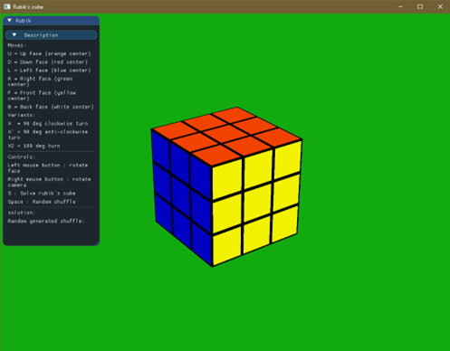
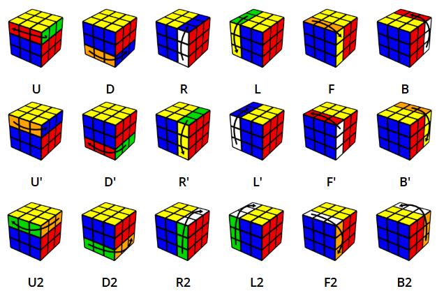

# Rubiks-cube

# 1. A program telepítése és futtatása

A program nem igényel előzetes könyvtárak vagy függőségek telepítését, minden szükséges komponens statikusan van linkelve, ezért a `Cube` mappában található `.exe` kiterjesztésű fájl futtatása elegendő Windows 10/11 operációs rendszerrel rendelkező gépek esetén.

# 2. Rendszerkövetelmények

A szoftver szinte minden átlagos teljesítményű, 64 bites Windows 10/11 operációs rendszerrel rendelkező számítógépen futtatható. Egyetlen technikai követelmény a legalább OpenGL 4.6-ot támogató grafikus kártya megléte.

# 3. A program használata

A futtatást követően a program pár pillanat erejéig tölt a hardvertől függően, majd a felhasználót egy letisztult UI és egy Rubik-kocka fogadja.

A felhasználó a `description` lenyíló fülre kattintva információt szerezhet az alkalmazást irányító billentyűkiosztásról. A kockával az egeret használva tud interakcióba lépni:

- A jobb egérgomb lenyomásával és az egér mozgatásával képes a kamerát az objektum körül forgatni.
- A bal egérgombbal a kockára kattintva, majd az egeret elmozdítva a kocka az elmozgatás irányának megfelelően forog.

Kivételt képeznek ezen forgatások alól a vízszintesen és függőlegesen középen található síkjai a kockának.

## 3.1. Billentyűk

- **Space**: 20 random mozdulatot alkalmaz a kockán, ezzel megkeverve azt. Ezeket a mozdulatokat az ablakban található `Random generated shuffle:` után írja ki.
- **S**: A megoldó algoritmust indítja el, és a megoldáshoz vezető lépéseket a `solution` után jeleníti meg.
- **Esc**: A program bezárása

## 3.2. Singmaster notáció

A `description` rész tartalmaz egy rövid tájékoztatót a Singmaster notation-ről, ami a Rubik-kocka mozdulatok leírására szolgál.

A mozdulatokat a kocka oldalai alapján különböztetik meg:

- `U` (Up) – felső oldal
- `D` (Down) – alsó oldal
- `L` (Left) – bal oldal
- `R` (Right) – jobb oldal
- `F` (Front) – elülső oldal
- `B` (Back) – hátsó oldal

A jelölések értelmezése:

- A betű önmagában egy, az oldal órajárással megegyező irányú 90 fokos forgatást jelent.
- Ha a betűt egy `'` (aposztróf) követi, akkor az órajárással ellentétes irányú forgatást jelöl.
- Ha a betűt egy `2` szám követi, az az oldal 180 fokos forgatására utal.

## 3.3. Mozdulatok követése

Az alkalmazás a felhasználó által végzett mozdulatokat a `solution` részben nyilvántartja.

- Például egy `U` mozdulat esetén annak inverze (`U'`) kerül a solution-be.
- Ekvivalens, inverz vagy redundáns mozdulatok (pl. egymást követő `R'`, `R`) nem jelennek meg, mivel "kioltják" egymást.

Ezáltal a `solution` hossza dinamikusan változik, megkönnyítve a lépések követését.

## 3.4. Egyéb funkciók

- A random forgatások a `Random generated shuffle` mezőben maradnak, amíg a kocka vissza nem tér a megoldott állapotba. Ezután automatikusan törlődnek.
- A háttérszín visszajelzést ad a kocka állapotáról:
  - **Zöld** háttér: megoldott állapot
  - **Kék** háttér: a feladvány még nincs megoldva

